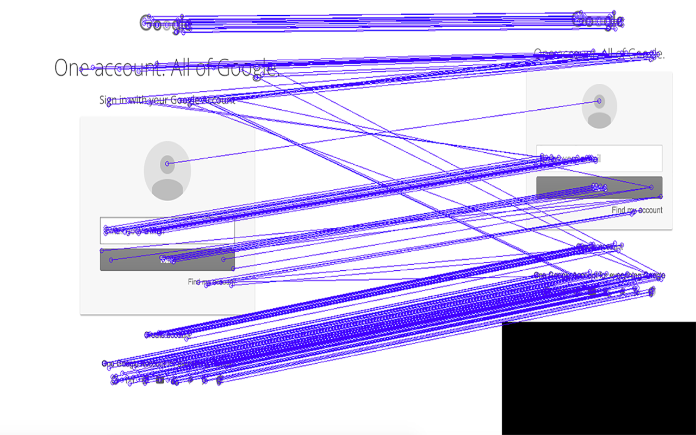
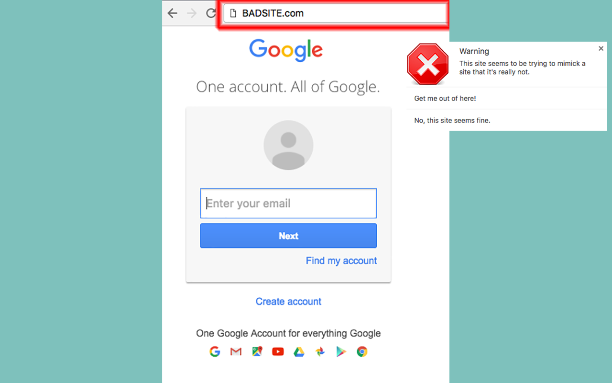

# Phisher: Computer vision approach to phishing detection.

Using SIFT and a FLANN kd-tree to detect phishing sites by comparing visited paged to known site UIs and then comparing the URL. If a visited page visually looks like a known site but doesn't have a URL known for that page, then an alert is shown to the user.

A few months ago, the Exploratorium in San Francisco had its network compromised due to a phishing attack. An employee hurriedly filled out her credentials in what looked like a Google Docs sign-in but was actually a hacker's fake site.

Current solutions to phishing are limited to forcing employees to attend training to spot these hacks and attempting to judge the URL's reputation. People don't have time to pay attention to every url they click. This is especially true when faced with deadlines. Even the technical systems we have in place to detect these sites rely on the page's reputation. This strategy fails in targeted attacks like the Exploratorium and is reactive at best.

I created Off The Hook to have a proactive response to phishing sites. Rather than relying on reputation systems and employee training, I automated the behavior the training hoped to instill. Off The Hook is an extension that visually inspects web sites as a human would do and recognizes when pages look like valid sites. If the page looks like a valid site but isn't a URL that we'd expect that site to be at, then we throw a red flag and get the user out of there. 

###Comparing visited page to known UI across device formats.

 

###An alert instance.

 

###Logo
